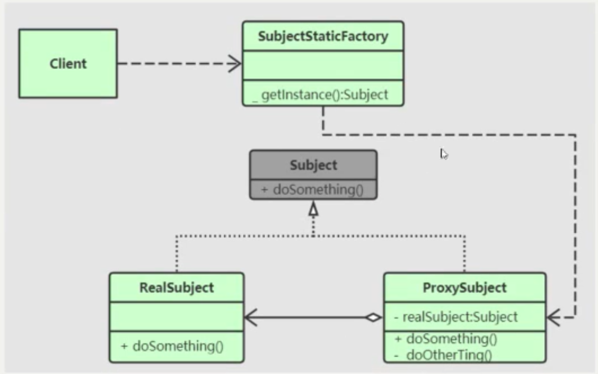

# 代理模式的优点
-   职责清晰
-   编程简介清晰
-   屏蔽保护
-   低耦合高内聚，易扩展

## 静态代理
### 什么是静态代理   
-   代理类与委托类是一一对应的，十个不同的委托类就要有十个不同的代理类
-   代理类需要自己编写，代理类与委托类的关系在程序运行前就已经确定

### 静态代理结构

### 静态代理的缺点
-   代理对象的一个接口只服务于一种类型的对象，如果要代理的方法很多，势必要为每一种方法都进行代理，静态代理在程序规模稍大时就无法胜任。
-   如果接口增加一个方法，除了所有实现类需要增加这个方法以外，所有代理类也需要实现此方法，增加了代码维护的复杂度

## 动态代理

### 什么是动态代理

- 你想让它代理谁它就代理谁，它会给你生成一个代理对象（代理你指定的类），用其完成具体代理逻辑

- 动态代理类的源码是在程序运行期间由JVM根据反射、asm生成Java的字节码等机制动态的生成，所以不存在代理类的字节码文件。代理类和委托类的关系是在程序运行时确定

  - ams： 一个小而快的**字节码**处理框架，用来转换字节码并生成新的类

  

### 动态代理的缺点

- 效率问题（毕竟需要根据委托类class对象信息动态操作字节码生成代理类

### 动态代理原理探究

## jdk_动态代理

-   本体必须实现接口， 才能被代理

### 原理探究

- 调用代理逻辑的执行器InvocationHandler（它并不是实际上的代理类）

## cglib_动态代理

- 对 jdk动态代理的补充， 在不实现接口的情况下也能进行代理